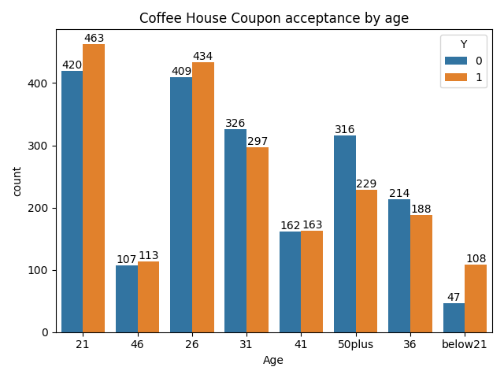

# PCAIML_practical_App1: Will the Customer Accept the Coupon

## Overview
The goal of this project is to distinguish between customers who accepted a driving coupon versus those that did not.

## Dataset
You can find the dataset used to make the analysis in this [path](../data/coupons.csv).

## Tools and libraries
Python programming language was used to read the dataset. libraries such as panda, seaborn, matplotliib for analysis and visualizing.
the details of the anaysis, comments and visualization charts can be found in the following [jupyter notebook](prompt.ipynb)

## Exploratary Data Analysis

### Missing data
A significant portion of the values in the car column are missing, rendering it uninformative for analysis. Therefore, We safely dropped the car column, as it holds little to no significance in the dataset.
On the other hand, columns such as coffeeHouse and CarryAway contain only a small number of missing values, which are negligible and unlikely to affect the overall integrity or outcomes of the analysis.
Since the first part of the project focused on the Bar coupon we also dropped the nan for Bar columns.

### Anaysis and findings for bar coupon.

* Proportion of bar coupons accepted:  ~41%
* Acceptance rate for those who went to bar 3 or less times is :~ 37%
* Acceptance rate for those who went to bar more than 3 times is  : ~77%
* Acceptence rate of driver over 25 yrs : ~69%
* Acceptence rate of driver of all others : 67%
* Acceptance rate of drivers with passengers other than kids and occupation that is not farming, fishing or Forestry is:  ~71%
* Acceptance rate of all others :  ~57%
* Acceptance rate for conditions_1 ~72%
* Acceptance rate for conditions_2 : ~72%
* Acceptance rate for conditions_3 :~77%

### Hypotheses on Bar coupon
Based on the analysis, approximately 56% of the observed population accepted the bar coupon.

**BAR Frequency**: Among those offered with bar coupons, about 41% accepted it. Notably, individuals who visited bars frequently—defined as more than three times per month—were significantly more likely to accept the coupon, with an acceptance rate of approximately 76%.

**Age** Age does not appear to significantly influence the decision to accept a bar coupon. Both younger drivers (under 25) and older drivers (over 25) demonstrated similar acceptance patterns and rates.

**Occupation** Drivers working in primary sectors of the economy—such as farming and fishing—were more selective, with an acceptance rate of around 56%, which is comparatively lower than those in other professions. This may suggest that individuals from primary sectors lead lifestyles with fewer social engagements.

**Children** Drivers under the age of 30 who were accompanied by a partner but no children were more likely to accept the coupon. This could indicate that younger demographics, particularly those without family responsibilities, tend to have more outgoing social habits.

**Economics** Economic background and dining preferences also played a role. Individuals with an income below $50,000 and a tendency to frequent less expensive restaurants showed moderate selectivity when deciding whether to accept the coupon.

In conclusion, a driver’s decision to accept a bar coupon appears to be influenced by a combination of economic status, marital and parental status, and frequency of bar visits. These factors offer insights into the social behavior and preferences of different segments of the population.

## Independent Investigation on Coffee House Coupon.

The goal was to determine the characteristics of passengers who accept the Coffee House coupons

### Visualization and findings.
the overall acceptance rate of the coupon is **49.9%**

* acceptance rate of male driver who went to coffee house more than 4 times :  68%
* acceptance rate of female driver who went to coffee house more than 4 times :  67%

### Hypotheses
approximately 50% of the individuals who received a coupon for a coffee house chose to use it. The gender of the driver appeared to have no significant influence, as both male and female drivers had a coupon acceptance rate of around 67%. 

However, the frequency of coffee house visits within a month did impact the likelihood of coupon acceptance — those who visited more often were more inclined to use the coupon.

Additionally, 95% of those who accepted the coupon were either single, in a relationship, or married, indicating a possible correlation between relationship status and coupon usage behavior.

## Next Step and Recommendations
Based on the above hypotheses, here are the next steps recommendation

* Conduct a more nuanced segmentation to uncover subtle patterns that includes exploring correlation between columns such as time, weather, and destination to better understand how these factors influence coupon acceptance behavior.
* Develop a model that predicts the coupon acceptance based on other external patterns like location, traffic, time to destination etc

